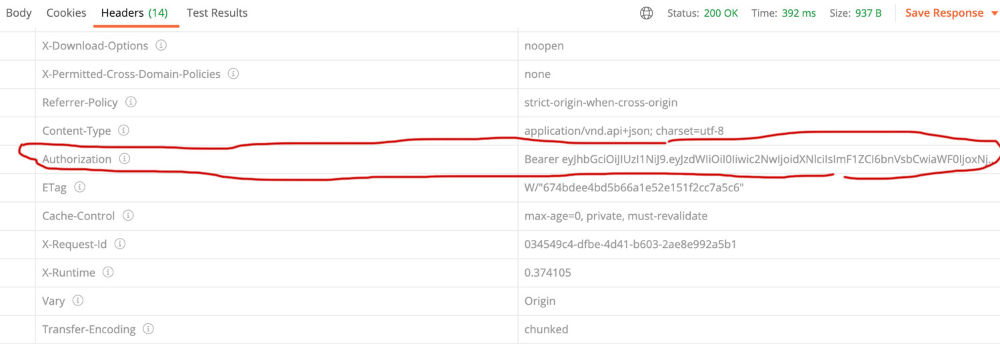

# Amazing Health API
Amazing health app allows patient-doctor interaction/sessions to be seemless.

## Built With

- Ruby v2.6.5
- Ruby on Rails v6.0.3.2
- RSpec-Rails

## Current API Endpoints

Our API will expose the following RESTful endpoints.

| Endpoint                | Functionality                |
|-------------------------|------------------------------|
| POST api/signup         | Signup                       |
| POST /api/login         | Login                        |
| DELETE /api/logout      | Logout                       |
| GET /users              | List all users               |
| GET /users/:id          | List a user                  |
<hr>


## Consuming the API

**Signup**
POST `http://localhost:3000/api/signup`

```json
{
    "user": {
        "username": "test",
        "email": "test@gmail.com",
        "password": "password"
    }
}
```

```json
// Results
{
    "data": {
        "id": "1",
        "type": "users",
        "attributes": {
            "username": "test",
            "email": "test@gmail.com",
            "role": "standard"
        },
        "links": {
            "self": "http://localhost:3000/api/users/1"
        }
    },
    "jsonapi": {
        "version": "1.0"
    }
}

```

**Login**
POST `http://localhost:3000/api/login`

```json
{
    "user": {
    "email": "test@gmail.com",
    "password": "password"
}
}
```

```json
// Results
{
    "data": {
        "id": "4",
        "type": "users",
        "attributes": {
            "username": "test",
            "email": "test@gmail.com",
            "role": "standard"
        },
        "links": {
            "self": "http://localhost:3000/api/users/1"
        }
    },
    "jsonapi": {
        "version": "1.0"
    }
}

```

The authorization is embedded in the header

## Getting Started

To get a local copy up and running follow these simple example steps.

### Prerequisites

Ruby: 2.6.5
Rails: 6.0.3.2
Postgres: >=9.5

### Setup

~~~bash
$ git clone https://github.com/acushlakoncept/todo-api.git
$ cd todo-api
~~~

Install gems with:

```
bundle install
```

Setup database with:

> make sure you have postgress sql installed and running on your system

```
   rails db:create
   rails db:migrate
```

### Usage

Start server with:

```
    rails server
```

Open `http://localhost:3000/` in your browser.

### Run tests

```
    rpsec 
```

# Authors

👤 **Uduak Essien**

- Github: [@acushlakoncept](https://github.com/acushlakoncept/)
- Twitter: [@acushlakoncept](https://twitter.com/acushlakoncept)
- Linkedin: [acushlakoncept](https://www.linkedin.com/in/acushlakoncept/)


## 🤝 Contributing

Contributions, issues and feature requests are welcome!

Feel free to check the [issues page](issues/).

## Show your support

Give a ⭐️ if you like this project!
